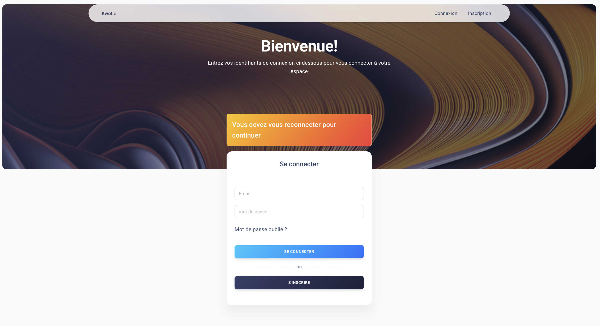
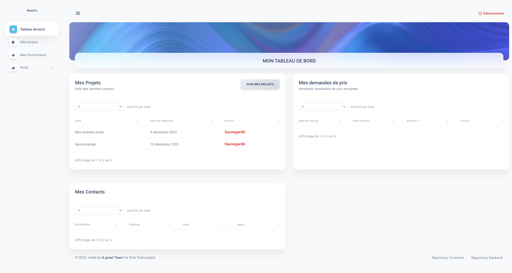
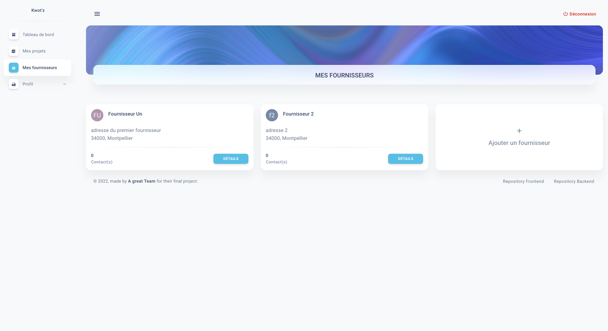
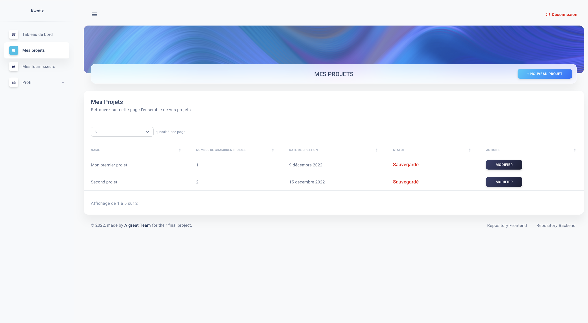

# KWOT'Z BETA 🧊

 

## Team Vocal_15

 

# KWOT'Z 🧊

Projet final cloturant la session Dev summer 22 de ✨ **The Hacking Project.** ✨
[Visiter KWOT'Z](https://kwotz-beta.vercel.app/)

Notre cible sont les PME spécialisées dans l’installation de systèmes de réfrigération et climatisation.
Aujourd’hui lorsque l’installateur ou son commercial doivent chiffrer une installation, ils prennent des notes directement sur site. C'est en rentrant au bureau qu'ils doivent les mettre en ordre/en forme sur un mail qu’ils vont envoyer à leurs fournisseurs pour obtenir une étude et un prix. Cette deuxième étape nécessite du temps que l'installateur n'a pas forcément tout de suite et il se peut qu'il lui manque des informations pour l'établissement de l'étude.

C'est pourquoi nous avons pensé 🧊 **KWOT'Z BETA** 🧊, une application sur laquelle il sera possible de réaliser les demandes de devis grâce à un formulaire que l'utilisateur pourra remplir sur site et envoyer la demande par mail au fournisseur directement depuis l’application.

[How to acces](#How-to-acces)

[Executive Summary](#Executive-Summary)

[User Flow](#User-Flow)

[User Stories](#User-Stories)

[Trello](#Trello)

[Data Base](#Data-Base)

[Authors Details](#authors-details)

[Preview](#preview)

## How to acces

↳ [KWOT'Z BETA](https://kwotz-beta.vercel.app/)

 

## Executive Summary

↳ [ici : 📝](https://docs.google.com/document/d/1uT31ixU_BI_L3Cv44s1gmr-CB6AgvSQRXGY0MQJa9yk/edit)

 

## User Flow

↳ [Miro](https://miro.com/app/board/uXjVP8mcAPA=/)

 

## User Stories

- En tant que visiteur j'arrive sur une landing page où je peux m'inscrire avec mot de passe et adresse email avec validation de l'adresse email.
- En tant qu'Utilisateur authentifié, une fois inscrit je suis invité à compléter mon profil utilisateur; j'ai accès à un dashboard où j'aurai la possibilité de créer un projet, l'éditer ou le supprimer; je peux voir la liste de tous mes projets; je peux voir mon profil, le modifier et changer mon mot de passe; dans mon dashboard, je peux voir mes fournisseurs, les modifier ou les supprimer, ajouter des contacts et accéder à la liste des contacts des fournisseurs; je peux sauvegarder mon projet en cours, le modifier ou le supprimer. 

 

## Trello 

↳ [How we organised](https://trello.com/b/EUFiO5HS/kwotz-beta) 

 

## Data Base

↳ [Our Data Base here](https://app.mural.co/t/vocal153031/m/vocal153031/1670078079761/b14e121f09d28f63c96101ee3e5b362c88342c0c?sender=ubb2de3acaa9fae39547b5937)

 

 
 

## Authors Details:

👤 **the famous and infamous Vocal_15**

- [@Chreees79](https://github.com/Chreees79)
- [@GuillaumeBrthlt](https://github.com/GuillaumeBrthlt)
- [@linahello](https://github.com/linahello)
- [@xko0](https://github.com/xko0) 
 

## Preview:

### Login Page

### Dashboard

### Fournisseurs

### Projets

